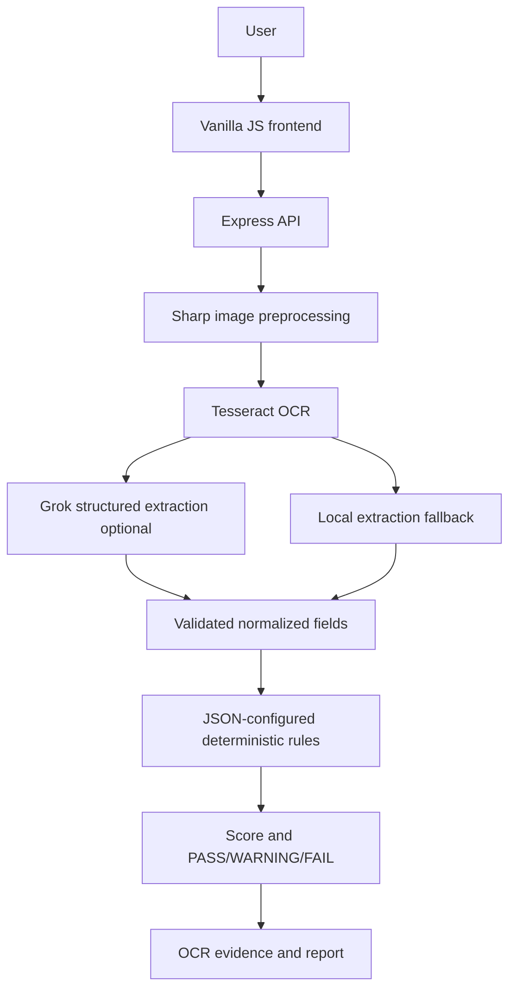

# Architecture

## Responsibility boundaries

- **Frontend:** upload, preview, sample selection, dashboard rendering, and HTML report download. It never contains the Grok key.
- **Express API:** validates uploads, assigns an inspection ID and timestamp, coordinates services, and returns one inspection response.
- **Preprocessing/OCR:** rotates, resizes, grayscales, normalizes, sharpens, denoises, and recognizes English declaration text. Confidence below 55% is surfaced as a warning.
- **AI extraction:** optional Grok call returns JSON fields only. It distinguishes explicitly labeled `mrp` from an unlabeled `visiblePrice` and is schema-normalized before use.
- **Rule engine:** reads `rules/complianceRules.json`, checks only the selected requirements, finds evidence from actual OCR lines, and calculates the prototype score. AI never makes the legal decision.

The application is stateless and intentionally uses no authentication or database in this MVP. Prepared sample fixtures are clearly marked as `SAMPLE DEMONSTRATION`; they are not presented as live analysis.

## Extension points

The OCR, extraction, compliance, and reporting services are separate so multilingual OCR, batch jobs, persistent history, reviewer corrections, coordinate-level evidence, expanded rules, and analytics can be added later without moving the current frontend to another framework.